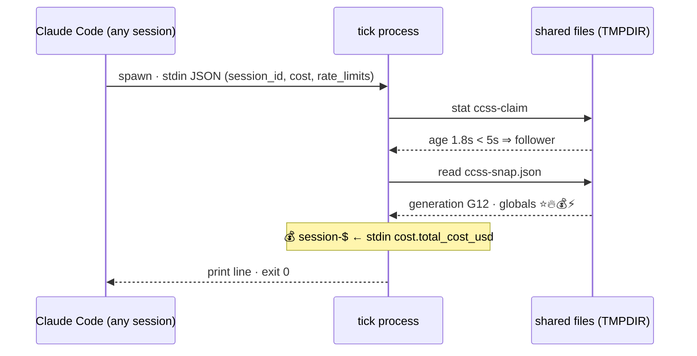
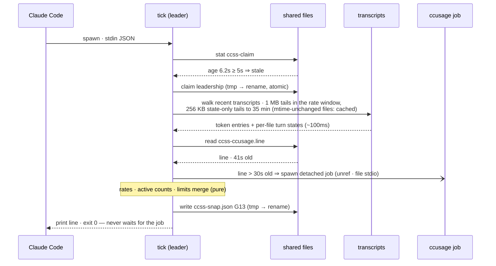
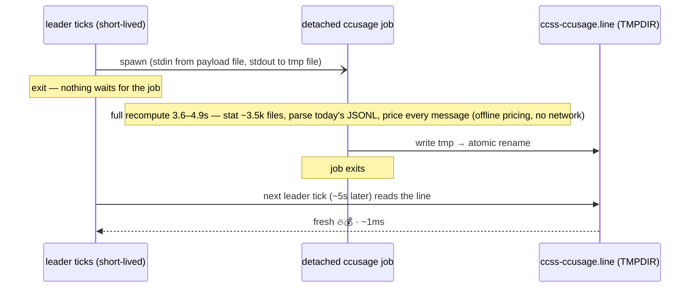

# cc-super-status

A souped-up [Claude Code](https://docs.anthropic.com/en/docs/claude-code) status line: model + effort, burn rate, **cross-session** token throughput, cost breakdown, and a colored quota bar — all on one line.

```
🥷 Opus 4.8 (xhigh) | 🔥 $13.18/hr | ⭐️ {50}300t/s 3[7] | 💰 $13.5 / $31 / $330 | ⚡ 42m 53% ▰▰▰▰▰▰▰▰▰▰▱▱▱▱▱▱▱▱▱▱
```

Runs on [Bun](https://bun.sh) (no build step — `bun run` executes the TypeScript directly).

## The segments

Segments are joined by ` | ` in this fixed order. The two **ccusage-derived** segments (🔥 / 💰) are omitted together if `ccusage` isn't available or its output can't be parsed, so the 🤖 and ⭐️ segments always render. ⚡ prefers Claude Code's own rate-limit data from stdin (independent of ccusage) and only falls back to the ccusage estimate when that data is absent.

| Segment | Meaning | Source |
| --- | --- | --- |
| 🥷 `Opus 4.8 (xhigh)` | Model + reasoning effort. The leading emoji is per-model — 🐉 Fable, 🥷 Opus, 🐱 Sonnet, 🤖 for anything else (Haiku, unknown). The ` (1M context)` tag is stripped (1M is the default now, so it's noise); effort is shown verbatim (e.g. `xhigh`), absent effort is omitted. | stdin JSON (`model`, `effort`) |
| 🔥 `$13.18/hr` | Current dollar **burn rate**, verbatim from ccusage. | `ccusage statusline` |
| ⭐️ `{50}300t/s 3[7]` | **Token throughput** over the sliding window, charge-weighted by default (⭐️; raw mode shows 🌟 — see below). `{cur}all` — `cur` = current session (this transcript + its subagents), `all` = every recent session. Collapses to a single `Nt/s` when `cur === all`. The trailing `<sessions>[<subagents>]` counts the sessions and sub-agents **working right now** — each transcript's turn state, classified from its tail (a silent in-flight turn stays counted for up to 30 minutes; a completed turn drops within a tick, a runner-stopped agent within minutes). Always shown (idle reads `0[0]`), so it never blinks out from under the following ` \| `. | transcripts on disk |
| 💰 `$13.5 / $31 / $330` | Cost: **session / block / today** (session to 1 decimal, block and today rounded). Session is instant and per-pane (stdin `cost.total_cost_usd`); block and today are account-global from ccusage. | stdin `cost` + `ccusage statusline` |
| ⚡ `42m 53% ▰▰▰▰▰▰▰▰▰▰▱▱▱▱▱▱▱▱▱▱` (+ `3d 2h 45% ▰▰▰▰▰▰▰▰▰▱▱▱▱▱▱▱▱▱▱▱` with `CCSS_WEEKLY`) | **Session remaining** (plus **weekly**, opt-in). The **5-hour** session bar always shows: `<reset> <%> <bar>` — time to reset, then `%` remaining with a colored bar (reset to the minute). With `CCSS_WEEKLY` set, a **7-day** weekly bar (reset as `Nd Nh`) is appended after a space; off by default, in which case it's neither computed nor shown. Base-layer color: red `< 20%`, amber `< 50%`, green otherwise. Uses Claude Code's first-party `rate_limits.five_hour` / `.seven_day` (`used_percentage` + `resets_at`, on stdin for Pro/Max since CC 2.1.132) — the official numbers, same as `/usage`. The 5-hour window falls back to the ccusage `$`-quota estimate (`(CCSS_QUOTA − block) / CCSS_QUOTA`) when first-party data is absent (e.g. API-key billing), while the weekly window has no ccusage equivalent. On a higher tier the bar becomes a **layered stack** (fighting-game style; Max 20x → 4 colour layers counting down from **400%**): a fixed 20-cell bar shows the current layer, its colour marks which reserve you're on (surplus layers violet→blue→cyan, then the emerald base), the held cells are solid (`floor(pct/5)` of them) and the single **frontier** cell — the one being consumed right now — is a **dimmed** shade of the fill, over a consumed track muted in the layer directly beneath (a neutral gray on the base). The emerald base keeps the amber/red low-quota warning, so it fires when your final reserve runs low. Layer count follows your plan or `CCSS_BAR_MODE`; per-layer width is `CCSS_CELLS` (default 20). | stdin JSON `rate_limits`, else `ccusage statusline` + `CCSS_QUOTA` |

### How the ⭐️ token rate works

`cc-super-status` scans `~/.claude/projects` for transcripts modified recently, reads the tail of each, and extracts one token event per assistant message. Events are:

- **deduped** by `message.id` (handles transcripts that repeat a row),
- **windowed** to the last `CCSS_WINDOW` seconds, and
- divided by the window length and rounded to a per-second rate.

**Effective (charge-weighted) rate — the default (⭐️).** Raw token counts are misleading because cache-read tokens dominate real usage (the cached context is re-read every turn) yet cost only a tenth of a base input token. So by default each component is weighted by its [Anthropic price ratio](https://docs.anthropic.com/en/docs/build-with-claude/prompt-caching#pricing) relative to base **input (1×)**:

| Component | Weight |
| --- | --- |
| `input_tokens` | 1× |
| `output_tokens` | 5× |
| `cache_creation_input_tokens` | 2× (all treated as 1-hour writes) |
| `cache_read_input_tokens` | 0.1× |

The result is a **cost-equivalent** throughput — "input-token-equivalents per second" — that tracks how fast you're actually burning money rather than raw token volume.

**Raw rate (🌟).** Set `CCSS_EFFECTIVE=0` to weight every component at 1× instead: `input + output + cache_creation + cache_read`. This matches how [ccusage](https://github.com/ryoppippi/ccusage) defines *total tokens*, so the throughput agrees with ccusage's totals. Raw mode renders with **🌟** so you can tell the two modes apart at a glance.

In either mode, `CCSS_CACHE=0` drops the two cache terms entirely (counting only `input + output`, weighted per the active mode).

`cur` counts only the active session — its main transcript plus any subagent transcripts under `<session_id>/subagents/` — while `all` counts every session in the window. This is what lets you see total throughput across parallel Claude Code sessions.

**Active session / sub-agent counts (`3[7]`).** Right after the rate, `cc-super-status` appends how many distinct **sessions** and **sub-agents** are working *right now* — sessions first, sub-agents in brackets. This is deliberately **decoupled from the token-rate window** — the rate is a 120s sliding average (smooth, but laggy), whereas "who's active" should snap up and down quickly. So the counts read each transcript's **turn state from its tail**: Claude Code writes a row the moment anything happens (your prompt at submit, a tool call at dispatch, its result at completion, end-of-turn markers within ~40ms of the turn finishing), so the last meaningful row says whether a turn is **in flight** — trailing prompt, dispatched tool call, tool result awaiting the model, a message mid-stream — or **done** (end-of-turn rows, a user interrupt, a workflow agent's terminal StructuredOutput call). A busy session stays counted through long thinking stretches and tool runs without requiring another write, and drops within one ~5s generation of its turn ending. (Write recency alone can't do this: transcripts go untouched for minutes mid-turn, so a recency window either misses busy sessions or lags idle ones.) The suffix is always rendered — idle shows `0[0]` rather than the segment disappearing — so the numbers ride down instead of the whole readout blinking in and out.

- A session's key groups its main transcript with its sub-agents, so it's counted **once** — and it stays counted while only its sub-agents are busy (e.g. a coordinator idle-waiting on background agents). Each sub-agent transcript is counted individually.
- The meaningful row's timestamp bounds activity. Busy evidence older than 30 minutes is presumed a corpse: a killed pane (or a prompt abandoned by quitting before the first response) never writes its end-of-turn row. Weaker evidence decays faster: a trailing mid-flush assistant row or an API error (`stalled` — the shape a runner-stopped workflow/task agent leaves behind, since those never get an end-of-turn row) drops after 5 minutes. File mtime only decides when to scan or invalidate the tail cache, so later metadata cannot revive an old turn. A transcript whose tail or row timestamp can't be classified falls back to a plain mtime-freshness window, `CCSS_ACTIVE_WINDOW` (default 15s).
- When you're idle-waiting on background sub-agents, the main session's own events go quiet, so Claude Code wouldn't re-run the status line on its own. Set [`refreshInterval`](https://code.claude.com/docs/en/statusline) in your `statusLine` settings (e.g. `5`) so the count keeps updating — and decays to zero promptly — on a fixed timer.

Handy when you fan out parallel sessions or spawn workflow/Task sub-agents and want to see the live concurrency at a glance.

## Data sources

- **stdin JSON** — Claude Code pipes a JSON blob to the status line command on every render (`model`, `effort`, `session_id`, `transcript_path`, `cwd`, `cost.total_cost_usd`, `rate_limits`). Drives the 🤖 segment, the 💰 **session** figure (instant and per-pane — Claude Code's own `cost.total_cost_usd`), and (when `rate_limits` is present) the ⚡ segment.
- **`ccusage statusline`** — the [ccusage](https://github.com/ryoppippi/ccusage) CLI. Resolved fastest-first: a `ccusage` on `PATH`, else bun's global bin (`~/.bun/bin/ccusage`, where `bun install -g ccusage` lands even when that dir isn't on `PATH`), else `bunx ccusage`. Drives the 💰 **block/today** figures, 🔥, and the ⚡ fallback. It never runs on a render path: a full recompute over a large `~/.claude/projects` takes seconds, so instead one **detached, never-killed** job (spawned by a leader only when the shared line is older than `CCSS_CCUSAGE_REFRESH`, default 30s, and no job is already running) writes a single machine-wide line file, and every tick just reads it. The job reads its stdin from a file and atomically renames its output over the line file, so every recompute that starts also lands; a failed run leaves the previous good line untouched. The line is served up to 10 minutes old and never past the 5-hour block reset it describes. 🔥 / 💰 drop only when no usable line exists yet (the first few seconds on a brand-new machine).
- **Transcripts on disk** — JSONL files under `~/.claude/projects`. Drives the ⭐️ segment. Walked by one leader per ~5s generation (see [Multi-session architecture](#multi-session-architecture--the-three-clocks)); other panes read the frozen result.

> **Keep ccusage updated when a new model ships.** `ccusage statusline` runs in offline mode by default, pricing tokens from a snapshot **bundled with the installed version**. A ccusage installed before a model's launch (e.g. ccusage 20.0.6 vs Claude Fable 5) silently prices that model's tokens at **$0**, so 🔥 and 💰 (and the ⚡ fallback) under-report. Fix: `bun install -g ccusage@latest`.

Each source fails independently: if ccusage times out or transcripts can't be read, the rest of the line still renders. The process **never throws** — on a total failure it emits the raw ccusage line if it has one, otherwise an empty string.

## Multi-session architecture — the three clocks

With several Claude Code sessions open, each pane's status line is rendered by its own short-lived process on its own schedule. Left alone, every pane samples the world independently and the global numbers disagree. The fix is one rule — **nobody waits for anything slow** — applied through three clocks, each sized to what its data costs to compute:

| Clock | Segments | Source | Compute cost | Data age at render (typical / worst) | Cross-pane coherence |
| --- | --- | --- | --- | --- | --- |
| **Instant** (every tick) | 🤖 model + effort · 💰 **session** $ | stdin JSON (`cost.total_cost_usd`) | free — Claude Code computes it | **0s / 0s** (fresh on every invocation) | n/a — legitimately per-session |
| **5s snapshot** | ⭐️ rate `{cur}all` · ⭐️ counts `N[M]` · ⚡ quota bars | leader's transcript walk + merged `rate_limits` | ~100ms, **once per 5s machine-wide** (leader only) | **~3s / ~10s** (snapshot age 0–5s + your pane's next tick 0–5s) | byte-identical within a generation; skew ≤ 1 generation |
| **30s job** | 🔥 $/hr · 💰 **today** + **block** $ · ⚡ fallback bar | detached `ccusage` recompute | 3.6–4.9s, background, **at most one machine-wide** | **~15–20s / ~45s** (≤30s trigger + ~5s job + ≤5s generation + ≤5s tick) | single global stream; all panes flip at a generation boundary |

Staleness notes, per clock:

- **Instant:** the two segments you watch while working are never stale — Claude Code hands them over at every invocation. Display latency is just "when does my pane tick next" (events, plus the `refreshInterval` timer).
- **5s:** the ⭐️ rate is a 120s sliding average, so ≤10s of snapshot age moves it by under ~8% — invisible. The `N[M]` active counts are turn-state driven: they rise with a turn's first row and drop within one generation of its last. Values are *frozen* into the snapshot, which is exactly what makes every pane print the same bytes.
- **30s:** dollar aggregates move slowly ($/hr, day totals), so trading ~20s of age for a 7–13% background duty cycle (instead of a pegged core at a 5s cadence) is the whole point. The data is monotone and never rendered past the 5-hour block reset it describes (stale lines that would show wrong-direction quota are dropped, not shown).

### Follower tick — the common case (~5 of 6 ticks, ≈10–25ms)



A follower computes nothing global: it reads the frozen snapshot, takes its own session cost from stdin, prints, and dies. Any two panes rendering generation G12 print identical global segments.

### Leader tick — first tick of an epoch (~1 of 6 ticks, ≈110–160ms)



Leadership is a claim file whose **mtime is the lease** — stale means "take over". A killed or crashed leader ages out within 5s and the next tick anywhere claims. The 30s check is a rate limiter on background work, not a gate on rendering: below 30s the leader simply uses the line it already has.

### The detached ccusage job — recompute off every render path



The job is **never killed and never piped** — it writes to a file and renames it into place, so every recompute that starts also lands. A fresh job-marker file rate-limits spawning: at most one recompute exists machine-wide, regardless of how many sessions are open.

The rate-limit merge that feeds ⚡ is **per-account**. The merge only ever ratchets forward — that is what stops an idle pane from dragging the shared bars backward — so an account switch would otherwise leave you looking at the previous account's near-empty bar until its windows expired. Two things prevent it: `ccss-limits.json` records which account contributed it and is discarded when you sign in as someone else, and a window is only allowed to roll forward to a later reset once the current one has actually expired. The second matters because panes already open when you switch keep reporting the old account's numbers until they next hit the API, so the stored merge alone can be re-poisoned within a tick.

Render *timing* stays per-pane (Claude Code repaints each pane on its own events), but all ticks inside one 5-second generation read the same frozen snapshot, so the numbers agree everywhere. The worst two panes can disagree by is adjacent generations of one monotone stream — which reads as "updating", not "broken". The 30s data rides the 5s loop: the leader copies the current ccusage line into every snapshot, so new dollars appear in all panes at the same generation boundary.

## Environment overrides

| Variable | Default | Meaning |
| --- | --- | --- |
| `CCSS_QUOTA` | `125` | Dollar quota per 5-hour block, used for the ⚡ 5-hour `%` bar **only in the ccusage fallback path** (ignored when Claude Code passes the five-hour rate-limit window on stdin). |
| `CCSS_WEEKLY` | `false` | Show the **7-day weekly** bar after the 5-hour bar. Off by default; the weekly window is neither computed nor rendered unless set to `1`/`true`/`yes`/`on`. |
| `CCSS_BAR_MODE` | `auto` | ⚡ bar **layers**. `max` → a **4-layer stack counting down from 400%**; `default` (aka `normal`/`1x`) → a single **100% bar**; `auto` → detect from your plan (Max 20x → 4 layers, else 1). The plan tier isn't on stdin, so `auto` reads it from `~/.claude.json` (`oauthAccount.organizationRateLimitTier`); any read failure falls back to 1 layer. Set `max`/`default` to force the layer count regardless of plan. |
| `CCSS_CELLS` | `20` | ⚡ bar **width** in cells — the per-layer width, independent of the layer count. Each cell is 5% of one layer; raise it to resolve each layer more finely, lower it (e.g. `CCSS_CELLS=10`) for a shorter bar. It doesn't set the layer count — that's `CCSS_BAR_MODE` / your plan. |
| `CCSS_WINDOW` | `120` | Token-rate sliding window, in seconds. |
| `CCSS_ACTIVE_WINDOW` | `15` | **Fallback** freshness window for the ⭐️ `<sessions>[<subagents>]` counts, in seconds — applied only to transcripts whose turn state can't be classified from the tail (`unknown`, e.g. after a transcript-format change). Classified transcripts live by their turn state instead: busy until the turn ends (bounded by a 30-minute corpse TTL; 5 minutes for stalled evidence — a trailing mid-flush row or API error), dropped immediately once ended. Independent of `CCSS_WINDOW`. |
| `CCSS_EFFECTIVE` | `true` | Charge-weight the token rate (output ×5, cache write ×2, cache read ×0.1, input ×1) so it tracks cost-equivalent tokens, shown with ⭐️. Set to `0`/`false`/`no`/`off` for raw 1×-per-token throughput, shown with 🌟. |
| `CCSS_CACHE` | `true` | Include cache tokens (creation + read) in the rate. Set to `0`/`false`/`no`/`off` to count only input + output. With `CCSS_EFFECTIVE=0` and `CCSS_CACHE=1` the raw rate matches ccusage's total-token definition. |
| `CCSS_CCUSAGE_REFRESH` | `30` | How stale (seconds) the shared 🔥/💰 ccusage line may get before a leader spawns a fresh background recompute. Bigger = less background work, older cost figures; a recompute is ~4s, so a 5s cadence would peg a core while 30s is a ~13% duty cycle. |
| `CCSS_STATE_DIR` | `$TMPDIR` | Directory for the cross-session coordination files (`ccss-claim`, `ccss-snap-*`, `ccss-limits.json`, `ccss-ccusage.*`). Override to relocate state off a noisy tmpfs. |

Other constants (rate lookback `max(CCSS_WINDOW, CCSS_ACTIVE_WINDOW) + 60s`, turn-state lookback 35 min with a 256 KiB state-only tail read, `1 MiB` tail read per rate-window transcript, projects dir `$HOME/.claude/projects`) are fixed in `src/config.ts` and `src/transcripts.ts`.

## Wiring it into Claude Code

Add to your `settings.json` (e.g. `~/.claude/settings.json`):

```json
{
  "statusLine": {
    "type": "command",
    "command": "bun run /Users/sybuu/Projects/cc-super-status/statusline.ts",
    "refreshInterval": 5
  }
}
```

Use bun's absolute path (e.g. `/opt/homebrew/bin/bun run …`) if the status line runs in an environment where `bun` isn't on `PATH`.

`refreshInterval` (seconds) re-runs the command on a fixed timer in addition to Claude Code's event-driven updates. It's recommended here: the ⭐️ live session/sub-agent counts should keep ticking (and decay to zero) even while the main session sits idle waiting on background sub-agents — a period when no events fire. `5` is a good balance: repaint cost scales with panes ÷ interval (~35ms per follower tick), the leader walks transcripts once per ~5s (~85ms) regardless of how often panes render, and `ccusage` runs only in a detached background job — no tick ever waits on it. Lowering it (min `1`) buys a snappier display at linearly more repaint cost.

Optionally set the env overrides inline for that command, e.g.:

```json
{
  "statusLine": {
    "type": "command",
    "command": "CCSS_QUOTA=200 CCSS_WINDOW=180 bun run /Users/sybuu/Projects/cc-super-status/statusline.ts"
  }
}
```

## Development

```sh
bun install   # pulls @types/bun
bun test      # runs the unit + deterministic e2e suite
```

### Layout

- `src/types.ts` — the shared contract (read this first).
- `src/config.ts` — `parseConfig(env)`: pure env → `Config`.
- `src/paths.ts` — `stateDir()`: where the cross-session coordination files live.
- `src/rate.ts` — `computeRatesBySession`: pure dedup → window → per-second rate, split by session.
- `src/format.ts` — pure rendering helpers (model, speed, bar, truecolor, quota).
- `src/transcripts.ts` — `gatherEntries` reads transcripts off disk into token events + per-file activity; `countActive` (pure) turns that activity into the live session/sub-agent counts.
- `src/ccusage.ts` — parses `ccusage statusline` output; `maybeSpawnCcusageJob` runs the detached recompute; `readCcusageLine` serves the shared line.
- `src/shared.ts` — leader election + the `SharedSnapshot` every pane reads (`resolveSnapshot`); pure `mergeRateLimits` / `parseStoredLimits` / `decideRole` / `buildSnapshot`.
- `src/buildStatusline.ts` — pure orchestrator composing the final line from a snapshot + stdin.
- `statusline.ts` — the impure entry point Claude Code runs.
- `test/` — unit tests per module plus a fixture-driven `e2e.test.ts`.
